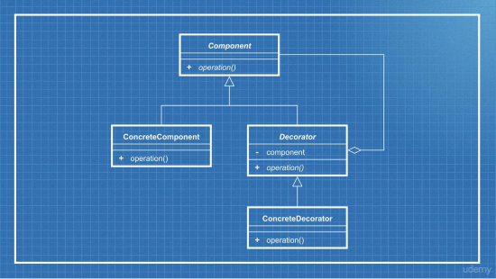

# Typescript main design patterns

## Introduction

A simple repository defining the 4 main typescript design patterns by examples.

1. The adapter pattern

    
    

   

2. The decorator pattern
3. The facade pattern
4. The state pattern
5. The observer pattern

   
   

_you will find some files examples for each design patterns..._
